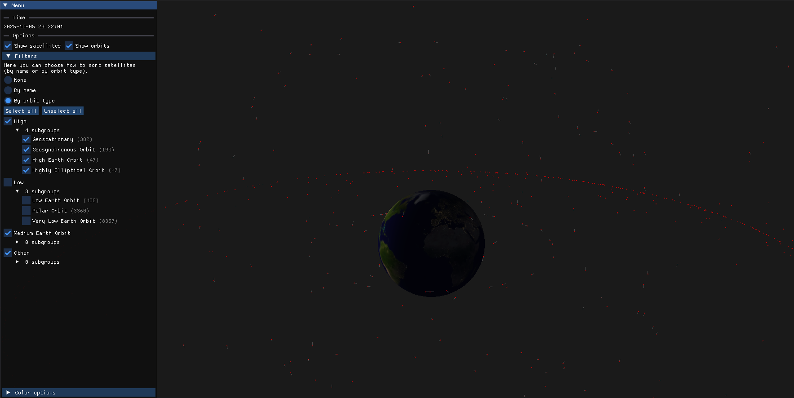

# Satellite Tracker :satellite: Трекер спутников



## :pencil: Описание

Satellite Tracker позволяет отслеживать положение спутников в реальном времени. 

#### Возможности

- :telescope: Наблюдение за спутниками и их траекторей движения
- :mag: Фильтрация по назначению летательных аппаратов или высоте орбиты
- :art: Кастомизация отображения

#### Описание работы

- Запрашивает актуальные орбитальные данные с Celestrak

- Парсит полученные TLE-данные

- Сохраняет в локальную базу (используется SQLite3)

- Вычисляет положение каждого аппарата

- Визуализирует орбитальное движение в реальном времени

## :hammer: Сборка

### Требования

- CMake версии 3.14 или выше

- Компилятор с поддержкой C++20 (MSVC, GCC, Clang)

- vcpkg для управления зависимостями

- Git (для клонирования репозитория и подмодулей)

#### Установка vcpkg

1. Клонируйте vcpkg:

    ``` git clone https://github.com/Microsoft/vcpkg.git ```
2. Запустите скрипт настройки:

- Windows (PowerShell):

   ``` .\vcpkg\bootstrap-vcpkg.bat ```

- Linux/macOS:

    ``` ./vcpkg/bootstrap-vcpkg.sh ```

#### Клонирование проекта
```
git clone https://github.com/your-username/SatelliteTracker.git
cd SatelliteTracker
git submodule update --init --recursive
```
### Сборка проекта
- Windows
```
# Генерация проектов Visual Studio
cmake -B build -S . -DCMAKE_TOOLCHAIN_FILE=[path/to/vcpkg]/scripts/buildsystems/vcpkg.cmake

# Сборка
cmake --build build --config Release
```
- Linux
```
# Генерация Makefile
cmake -B build -S . -DCMAKE_TOOLCHAIN_FILE=[path/to/vcpkg]/scripts/buildsystems/vcpkg.cmake

# Сборка
cmake --build build --config Release
```
Замените [path/to/vcpkg] на полный путь к вашей директории vcpkg.

### Запуск
После успешной сборки исполняемый файл будет находиться в папке ``` build/bin/ ```
